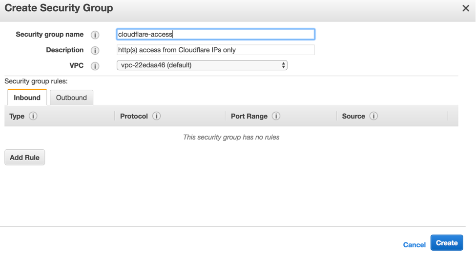
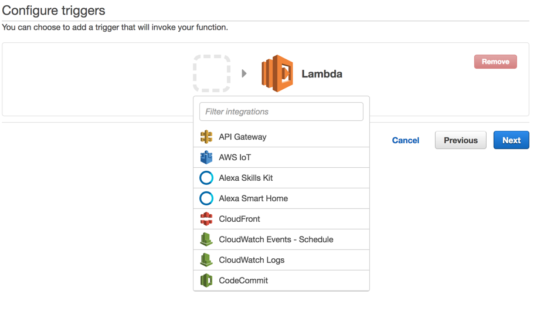
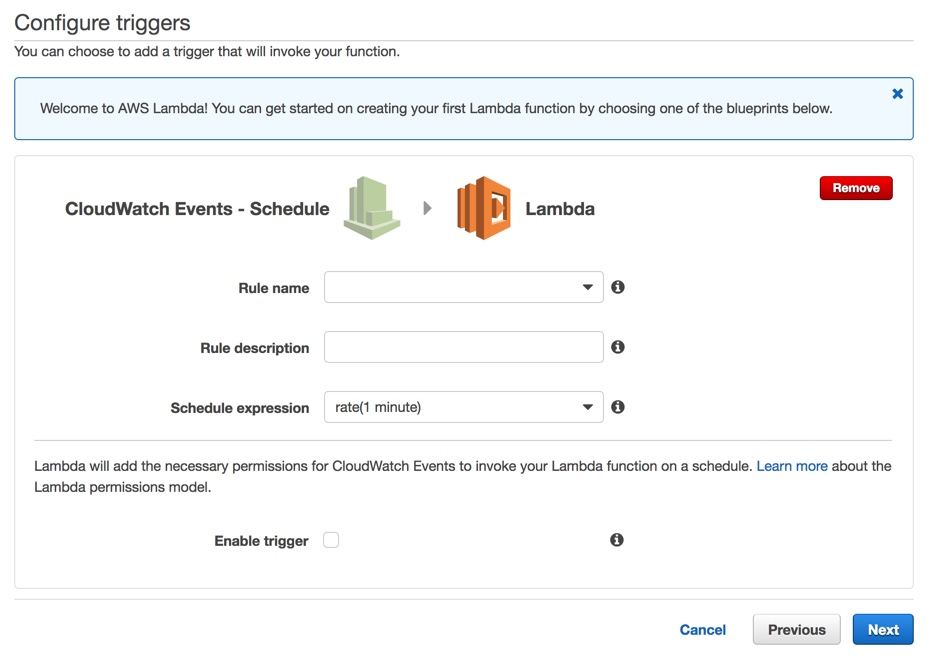

Despite the disappointing [Cloudbleed](https://arstechnica.com/security/2017/02/serious-cloudflare-bug-exposed-a-potpourri-of-secret-customer-data/) issues effecting [Cloudflare](https://www.cloudflare.com/) and its leaking of data, I'm still a big fan of the CDN service. Even the basic free service offers numerous caching and security features which would be pretty time consuming to implement yourself. At the very least it offers a free and very easy ssl certificate service.

Security should always be thought of as a layered process and Cloudflare plays an important role as a first line of defence. The ability to block out malicious or suspicious requests before it even reaches your server is a great asset. Obviously this only works if Cloudflare is positioned in front of your server and requests are forced to go through Cloudflare's proxy.


For any bad guy worth his salt, its relatively simple to figure out the real IP address of the server and bypass Cloudflare. Your server is now more vulnerable and security is now down to your server skills, up to date software and coding best practices.


Therefore its pretty important to stop direct access to your sites by only allowing web access from Cloudflare IP addresses. This blob post will cover doing this in the [Amazon Web Services](https://aws.amazon.com/) environment: 

* Creating a Security Group
* Assign Security Group to relevant EC2 instances.
* Create A Lambda function to regularly retrieve Cloudflare's IP address list and update the security group.

If you don't use AWS, the theory is still sound and wouldn't take much tweaking to achieve the same though a cron service and iptables. 

The Lambda code uses Python 2.7 and uses the [Boto3](http://boto3.readthedocs.io/en/latest/reference/services/ec2.html#securitygroup) library to communicate with AWS.

The Lambda Python code is available from the [github code repository](https://github.com/johnmccuk/cloudflare-ip-security-group-update). I'm relatively new to Python, so feel free to contribute and improve. 

##Create EC2 Security Group

Firstly create a Security Group and take note of the Group ID. This can be done through the AWS web interface:



Or from the [command line](http://docs.aws.amazon.com/cli/latest/userguide/cli-ec2-sg.html):

`aws ec2 create-security-group --group-name cloudflare-access --description "http(s) access from Cloudflare IPs only" --vpc-id VPC-ID-GOES-HERE`


Keep a note of the Group ID as will use this as an environmental variable with our Lambda code.

##Create a Lambda Function
As these IP addresses may change, we need some code to update them. As were in the AWS environment, we can easily do this from a Lambda function which we can run on a regular basis for next to nothing.

If your not familiar with AWS Lambda, its software as a service facility where you can place some code (C#, Java Python or Node) and you only pay for the time that the code runs. No need to maintain a server, just code, pure glorious code!

So heres the code repository for one [I did earlier](https://github.com/johnmccuk/cloudflare-ip-security-group-update).

The required code is in the file **cf-security-group-update.py**. For those not familiar `def lambda_handler(event, context):` is the main function thats called when the Lambda is triggered. What happens from here should be self explanatory from the descriptive function names.

###Select blueprint
From the AWS user interface, select ***new function*** and select ***Blank Function*** from the blueprint list.

###Configure triggers
Next, set a Trigger by clicking on the blank square and selecting ***CloudWatch Events - Schedule***.


You can set up your required CRON or defined rate from here. For now select Rate(1 day) to run this daily.




###Configure function
Now give the Lambda a name, choose Python from the runtime list and then paste the contents of **cf-security-group-update.py** from the [github code repository](https://github.com/johnmccuk/cloudflare-ip-security-group-update) in the text area.

In the ***Environment variables*** section, add the following:

```
key: SECURITY_GROUP_ID
value: add your security group id here
``` 

```
key: PORTS_LIST
value: 80,443
``` 

add **80** or **80,443** dependant on if you want http and https added to the security group.

You may need to add a role in the ***Lambda function handler and role*** section. If so the only rule needed is: 

```
"Statement": [
        {
            "Effect": "Allow",
            "Action": [
                "ec2:AuthorizeSecurityGroupIngress",
                "ec2:DescribeSecurityGroups"
            ],
            "Resource": [
                "*"
            ]
        }
    ]
```

Set the ***Timeout*** to maybe 5-8 seconds.

Keep the rest of the default values, continue and review, once happy finish by clicking ***Create Function***.

###Test
Click the ***Test*** button and accept the defaults and the Lambda should hopefully work. The output should list the IP addresses added.

To check it actually did add them, go back into the EC2 section and check your **cloudflare-access** security group and hopefully it contains IP addresses. Try deleting some and running the Lambda again, it should replace them.

There you go, you now have a Lambda function that will run routinely and will update the specified Security Group with any new CloudFlare IP addresses, Done!

###Issues
If it didn't work or you got error messages:

* **Cloudflare response error** - for some reason the cloudflare API wasn't available.
* **Failed to retrieve Security Group** - The Group ID used was incorrect.
* If the Lambda times out, click in the ***Configuration*** tab and set the ***Timeout*** to a higher value, 10 seconds should be adequate.
* Any other errors are probably due to the Security Role being incorrectly setup. Its [Stack Overflow](http://stackoverflow.com) time!
