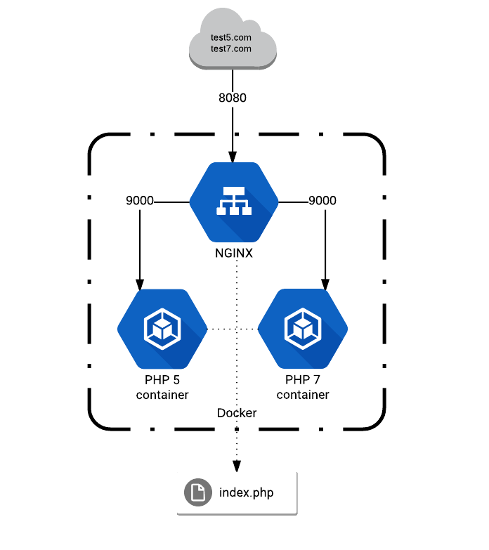

Docker is a great piece of technology. It's a nice way to setup a development environment or experiment with new software without actually clogging up your own system. 

I was messing around with serving some webpages using Docker with Apache and PHP. How could I easily switch PHP versions without clogging up my local machine or creating multiple Docker images/Vagrant boxes? I'm sure lots of developers could easily find a solution, but I must admit I do have trouble conceptualising container solutions. The layers of abstraction cause a mental block, I'm sure I'm not alone with this. 

It struck me that Apache/PHP doesn't fit into the Docker ***one process per container*** doctrine. PHP and Apache as so glued together that in regard to [separation of concerns](https://en.wikipedia.org/wiki/Separation_of_concerns), it's a non starter.

I really wanted my web server container to be isolated from the programming language. Switching to NGINX and PHP-FPM offers a much cleaner separation, which allows us to switch language versions with ease. This could be handy if you have legacy sites that require different versions or you want to try out a site before upgrading.

## Setup
So the plan will be that when a request is sent to the *test5.com/index.php* url, the Nginx container will pass the request to process *index.php* onto a container running PHP 5 and obviously the equivalent for *test7.com/index.php* and PHP 7.

First things first, add 2 entries to the `/etc/hosts` file:

```
127.0.0.1 test5.com
127.0.0.1 test7.com 
```

These will be the addresses we use to access the Nginx container.

Download or clone the repository from GitHub [docker-php-isolation-example](https://github.com/johnmccuk/docker-php-isolation-example) to a suitable place on your system. All commands will be ran from the CLI from within this folder.

The folder structure is relatively simple:

* **webroot** - the self explanatory folder which contains a file called `index.php` which contains the `phpinfo()` command.

* **site.conf** - Nginx site(s) configuration file.

* **docker-compose.yml** - docker setup configuration file.
        
 The *docker-compose.yml* file sets up 3 containers, all based on Alpine Linux image, so the total for the containers is a tiny 120Mb.
 
```
version: '2'
services:
    web:
        image: nginx:alpine
        ports:
            - "8080:80"
        volumes:
            - ./webroot:/var/www/html
            - ./site.conf:/etc/nginx/conf.d/site.conf
        links:
            - php7
            - php5
    php7:
        image: php:7-fpm-alpine
        volumes:
            - ./webroot:/var/www/html
    php5:
        image: php:5-fpm-alpine
        volumes:
            - ./webroot:/var/www/html
```
 
The main container is the Nginx proxy, which is the only container with an external port (8080). This container proxy's any valid requests to the two other containers, one running php 7 php-fpm, the other php 5 php-fpm on port 9000.



the *webroot* folder is shared between all 3 containers, Nginx needs this to serve any non PHP files, while the PHP containers need access to the PHP files.

The *site.conf* file contains defines how Nginx treats requests:

```
server {
    listen 80;
    index index.php;
    server_name test7.com;
    root /var/www/html/;

    location ~ \.php$ {
        try_files $uri =404;
        fastcgi_split_path_info ^(.+\.php)(/.+)$;
        fastcgi_pass php7:9000;
        fastcgi_index index.php;
        include fastcgi_params;
        fastcgi_param SCRIPT_FILENAME $document_root$fastcgi_script_name;
        fastcgi_param PATH_INFO $fastcgi_path_info;
    }
}

server {
    listen 80;
    index index.php;
    server_name test5.com;
    root /var/www/html/;

    location ~ \.php$ {
        try_files $uri =404;
        fastcgi_split_path_info ^(.+\.php)(/.+)$;
        fastcgi_pass php5:9000;
        fastcgi_index index.php;
        include fastcgi_params;
        fastcgi_param SCRIPT_FILENAME $document_root$fastcgi_script_name;
        fastcgi_param PATH_INFO $fastcgi_path_info;
    }
}
```

I'm sure theres a way to incorporate both of these addresses into one and use a regular expression, but lifes too short.

## Running it
From the CLI, navigate into the folder where you downloaded the repository and type `docker-compose up -d`.

This will dowload the images if there not saved locally already and start the containers. Once finished type `docker ps` to make sure the 3 containers are running.

So open your browser of choice and type test5.com:8080 and you should see phpinfo() for PHP 5.


Next, type test7.com:8080 and you should see phpinfo() for, you guessed it, PHP 7!


And there you go, we can define which version of PHP to use to process the same index.php file, hours of fun...

## Tidying up
Had enough excitement? To close down the running containers, type `docker-compose down`, this should close and remove the containers. 

If you want to remove the downloaded images, type `docker images` and then `docker rmi IMAGE ID`, for example `docker rmi 4fe1b7f08eb1 8b057b9de580 1b95155d2daf` would remove the 3 images with IDs *4fe1b7f08eb1*, *8b057b9de580* and *1b95155d2daf*.

## Finally
The concept of offering PHP as a kinda ‘Software as a Service’ might be a humble idea, but its something I find really cool. Being able to isolate versions of a programming language interests me greatly and might be something that I try and incorporate in future projects.


